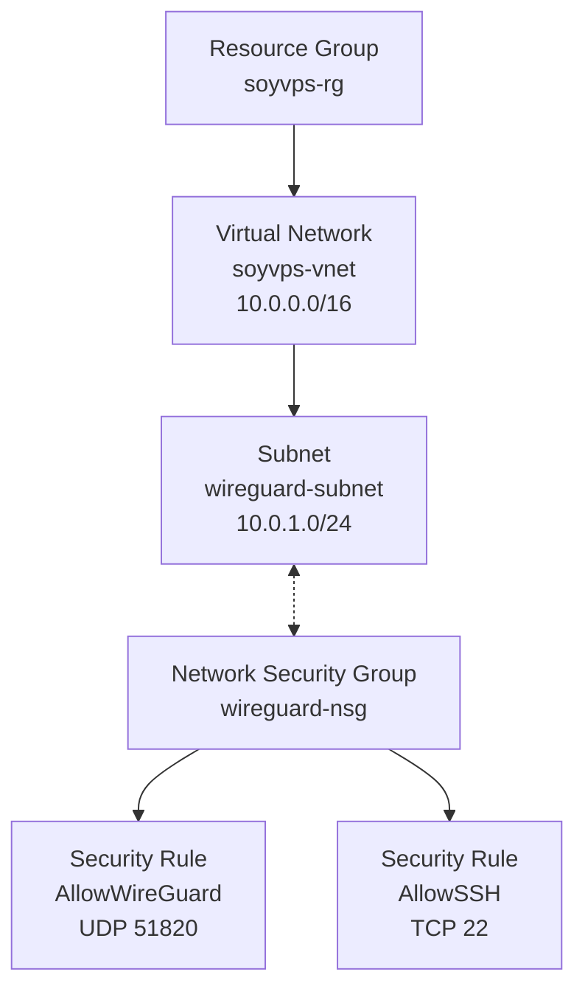
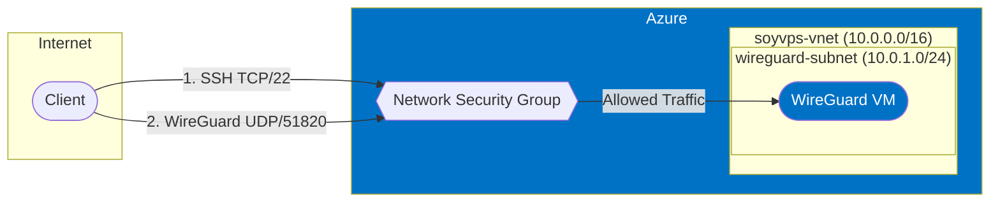

# Network Infrastructure

This directory contains Terraform configuration for the Azure network infrastructure needed for the WireGuard VPS.

## Architecture Overview

## Infrastructure Components

- **Resource Group**: `soyvps-rg` in New Zealand North region
- **Virtual Network**: `soyvps-vnet` with address space 10.0.0.0/16
- **Subnet**: `wireguard-subnet` with address prefix 10.0.1.0/24
- **Network Security Group**: `wireguard-nsg` with following rules:
  - Allow WireGuard UDP traffic on port 51820 (priority 1000)
  - Allow SSH TCP traffic on port 22 (priority 1001)

## Purpose

The network infrastructure provides an isolated and secure environment for the WireGuard VPN server with:

- A dedicated virtual network (VNet) with private address space
- A subnet for the WireGuard server
- Network security groups (NSGs) that only allow necessary traffic:
  - WireGuard UDP traffic (port 51820)
  - SSH access for administration

## Design Decisions

1. **Regional Selection**: New Zealand North region was chosen for optimal latency to the home Kubernetes cluster.

2. **Network Isolation**: Using a dedicated VNet (10.0.0.0/16) and subnet (10.0.1.0/24) provides network isolation and room for future expansion.

3. **Security First**: NSG rules follow the principle of least privilege, only allowing WireGuard and SSH traffic.

4. **Variable-Driven Configuration**: All network settings are parameterized with sensible defaults that can be overridden if needed.

## Network Flow Overview

## Next Steps

Once the network infrastructure is in place, the next step is to create the Ubuntu VM that will host the WireGuard server. 