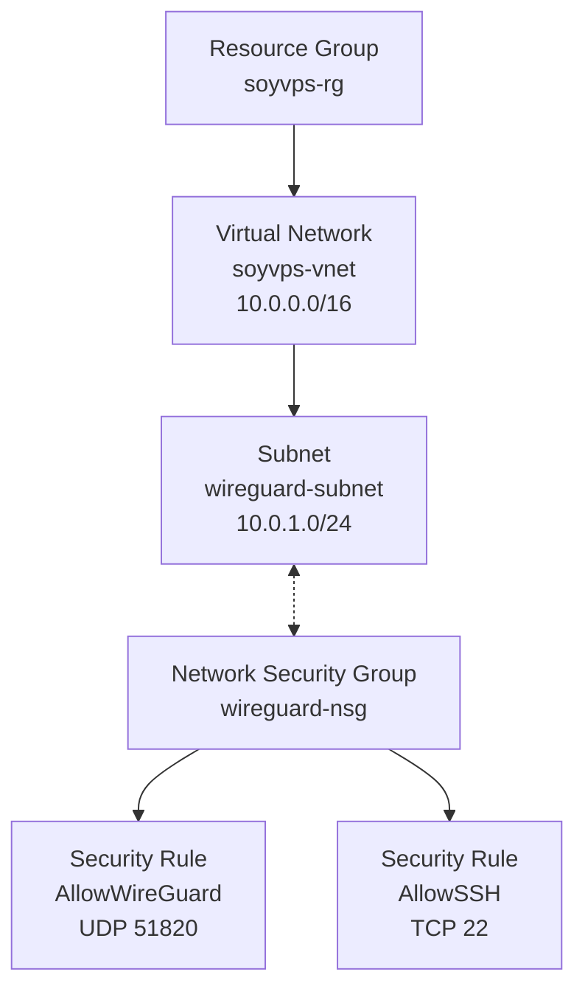
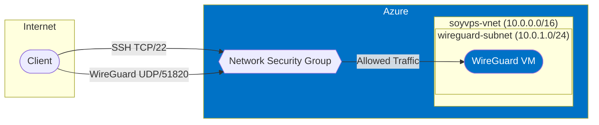

# Network Module

Azure network infrastructure for WireGuard VPN server access.

## Architecture



## Components

- **Resource Group**: `soyvps-rg` in New Zealand North region
- **Virtual Network**: `soyvps-vnet` with address space 10.0.0.0/16
- **Subnet**: `wireguard-subnet` with address prefix 10.0.1.0/24
- **Network Security Group**: `wireguard-nsg` with following rules:
  - Allow WireGuard UDP traffic on port 51820 (priority 1000)
  - Allow SSH TCP traffic on port 22 (priority 1001)

## Functionality

Isolated and secure network environment for the WireGuard VPN server with:

- Dedicated virtual network with private address space
- Subnet with NSG attachment
- Limited inbound traffic rules for WireGuard and SSH only
- Configurable through module variables

## Design Considerations

- **Region**: New Zealand North for optimal latency to home network
- **Network Topology**: Isolated VNet with dedicated subnet for the VPN server
- **Security**: Minimal attack surface with only required ports open
- **Configuration**: Parameterized with defaults that can be overridden

## Network Traffic Flow



## Module Usage

```hcl
module "network" {
  source = "./network"
  
  # Optional: Override default variables
  # location = "australiaeast"
  # resource_group_name = "custom-rg"
  # vnet_address_space = ["10.1.0.0/16"]
  # subnet_address_prefix = ["10.1.1.0/24"]
  # wireguard_port = 51820
}
```
