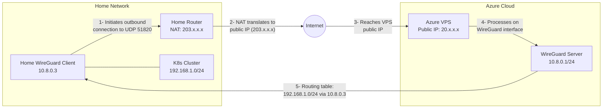
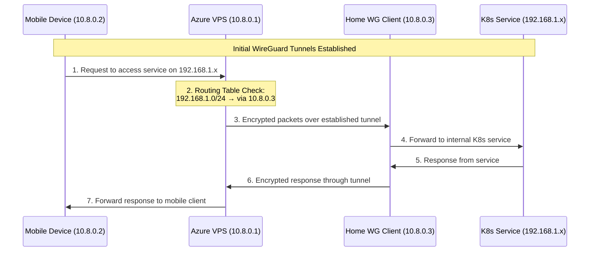
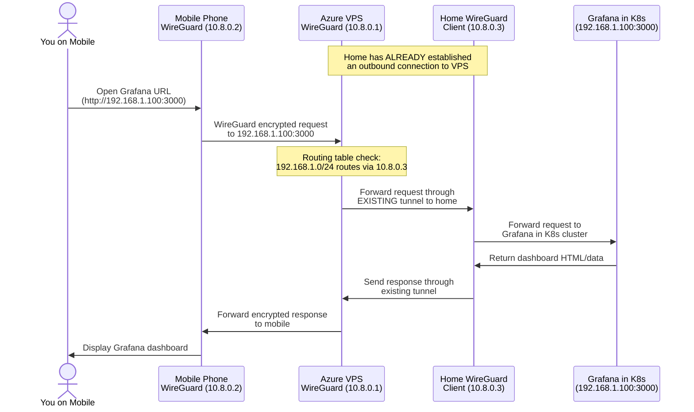
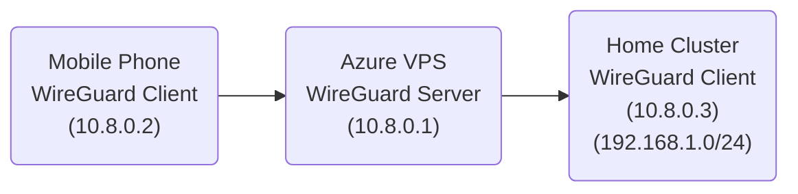
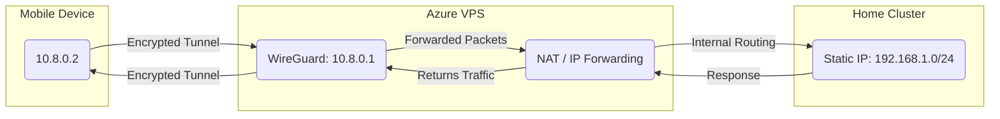
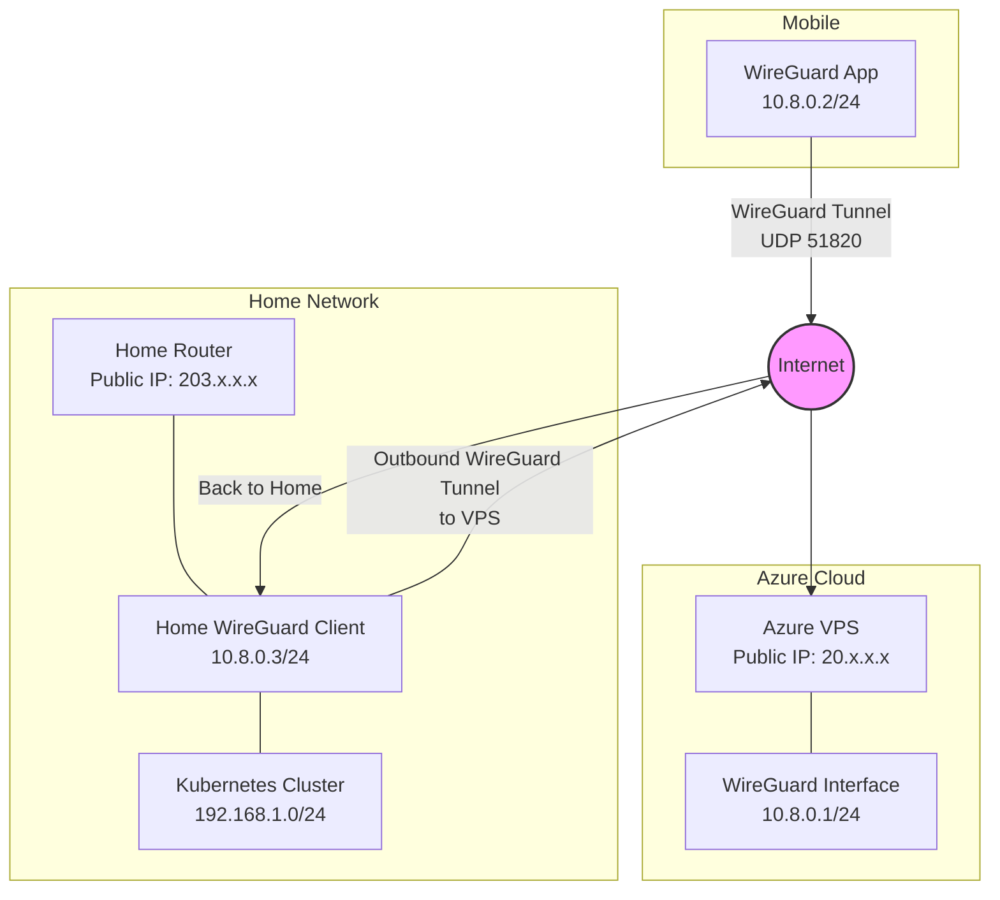

# ./plan.md

---

This file explains a direct, verifiable plan for connecting a mobile device to a home Kubernetes cluster without modifying home router ports, by using an Azure VPS as an intermediary with WireGuard in a hub-and-spoke model
---

## 1) Overview

1. Confirm that the home cluster uses static IP addresses on the internal network.
2. Use an Azure Linux VM as a WireGuard server ("hub") reachable from the internet.
3. Configure a persistent WireGuard client on the home network that connects outbound to the Azure VPS (no ports needed on home router).
4. Create WireGuard client configs for the mobile device and ensure that traffic destined for the home cluster passes through the Azure VPS.
5. Enable routing on the Azure VPS so that traffic from the mobile device VPN interface is forwarded to the home cluster via the persistent WireGuard tunnel.
6. Verify connectivity by pinging or running commands against the home cluster IP addresses.

## 2) Azure VPS Preparation

1. Create an Azure VM (Ubuntu or Debian-based) with a public IP address.
2. SSH into the VM:

   ```bash
   ssh <azure_username>@<public_ip_of_azure_vm>
   ```

3. Update packages:

   ```bash
   sudo apt-get update
   sudo apt-get install -y wireguard qrencode
   ```

4. Enable IP forwarding:

   ```bash
   sudo sed -i 's/#net.ipv4.ip_forward=1/net.ipv4.ip_forward=1/' /etc/sysctl.conf
   sudo sysctl -p
   ```

## 3) Configure WireGuard on the Azure VPS

1. Generate server key pair:

   ```bash
   cd /etc/wireguard
   sudo umask 077
   sudo wg genkey | tee server_private.key | wg pubkey > server_public.key
   ```

2. Create `/etc/wireguard/wg0.conf`:

   ```bash
   PUBLIC_IP="$(curl -s ifconfig.me)"  # Retrieves public IP address
   cat <<EOF | sudo tee /etc/wireguard/wg0.conf
   [Interface]
   Address = 10.8.0.1/24
   ListenPort = 51820
   PrivateKey = $(cat /etc/wireguard/server_private.key)
   PostUp   = iptables -t nat -A POSTROUTING -o eth0 -j MASQUERADE
   PostDown = iptables -t nat -D POSTROUTING -o eth0 -j MASQUERADE

   # Expose additional routes for the home cluster network (e.g., 192.168.0.0/24)
   # Adjust the AllowedIPs to match the actual home cluster subnet
   EOF
   ```

3. Start WireGuard:

   ```bash
   sudo systemctl enable wg-quick@wg0
   sudo systemctl start wg-quick@wg0
   ```

4. Confirm WireGuard is active:

   ```bash
   sudo wg show
   ```

## 4) Configure Home Cluster Routing

1. Install WireGuard on a machine in the home network (can be one of the Kubernetes nodes or a separate gateway):

   ```bash
   sudo apt-get update
   sudo apt-get install -y wireguard
   
   # Enable IP forwarding
   sudo sed -i 's/#net.ipv4.ip_forward=1/net.ipv4.ip_forward=1/' /etc/sysctl.conf
   sudo sysctl -p
   ```

2. Generate WireGuard keys for the home client:

   ```bash
   cd /etc/wireguard
   sudo umask 077
   sudo wg genkey | tee home_private.key | wg pubkey > home_public.key
   ```

3. Create WireGuard configuration for the home client:

   ```bash
   cat <<EOF | sudo tee /etc/wireguard/wg0-home.conf
   [Interface]
   Address = 10.8.0.3/24
   PrivateKey = $(cat /etc/wireguard/home_private.key)
   
   [Peer]
   PublicKey = <SERVER_PUBLIC_KEY_FROM_AZURE_VPS>
   Endpoint = <PUBLIC_IP_OF_AZURE_VPS>:51820
   AllowedIPs = 10.8.0.0/24
   PersistentKeepalive = 25
   EOF
   ```

4. Start and enable the WireGuard service on the home client:

   ```bash
   sudo systemctl enable wg-quick@wg0-home
   sudo systemctl start wg-quick@wg0-home
   ```

5. Add the home cluster as a peer on the Azure VPS by appending to `/etc/wireguard/wg0.conf`:

   ```bash
   # SSH into the Azure VPS and run:
   sudo bash -c "cat >> /etc/wireguard/wg0.conf" <<PEER
   
   # Home Cluster
   [Peer]
   PublicKey = <HOME_PUBLIC_KEY>
   AllowedIPs = 10.8.0.3/32, 192.168.1.0/24
   PEER
   ```

6. Restart WireGuard on the Azure VPS:

   ```bash
   sudo systemctl restart wg-quick@wg0
   ```

7. Verify the connection between the home cluster and Azure VPS:

   ```bash
   # On the home client
   ping 10.8.0.1
   
   # On the Azure VPS
   ping 10.8.0.3
   ping 192.168.1.x  # Replace with an actual IP in your home network
   ```

## 5) Add a Mobile Client

1. Generate client key pair (from the Azure VM, for clarity):

   ```bash
   cd ~
   umask 077
   wg genkey | tee client.key | wg pubkey > client.pub
   ```

2. Create `~/client.conf` (example):

   ```bash
   cat <<EOF > ~/client.conf
   [Interface]
   Address = 10.8.0.2/24
   PrivateKey = $(cat client.key)
   DNS = 1.1.1.1

   [Peer]
   PublicKey = $(cat /etc/wireguard/server_public.key)
   Endpoint = $(curl -s ifconfig.me):51820
   AllowedIPs = 0.0.0.0/0
   PersistentKeepalive = 25
   EOF
   ```

3. Append client as a peer to `/etc/wireguard/wg0.conf`:

   ```bash
   sudo bash -c "cat >> /etc/wireguard/wg0.conf" <<PEER

   # Mobile client
   [Peer]
   PublicKey = $(cat client.pub)
   AllowedIPs = 10.8.0.2/32
   PEER
   ```

4. Restart WireGuard:

   ```bash
   sudo systemctl restart wg-quick@wg0
   ```

5. Generate a QR code for quick mobile import:

   ```bash
   qrencode -t ansiutf8 < ~/client.conf
   ```

6. Scan the QR code with a WireGuard mobile app, save the tunnel, and enable it.

## 6) Verification

1. On the mobile device, confirm a "Connected" state after toggling the WireGuard tunnel on.
2. Attempt to reach the home cluster IP addresses directly. For example:

   ```bash
   ping <home_cluster_node_ip>
   curl http://<home_cluster_service_ip_or_domain>
   ```

3. Verify that traffic is successfully passing through the Azure VPS to the home cluster. For example, a web service running in the home cluster should be accessible, or a Kubernetes apiserver endpoint should respond.

## 7) Summary

- This plan creates a hub-and-spoke WireGuard topology with the Azure VPS as the central hub.
- The home cluster establishes an outbound WireGuard connection to the Azure VPS, creating a persistent tunnel.
- The VPS configuration listens on UDP port 51820 and forwards traffic between the mobile client and the home network.
- A persistent connection from the home network to the VPS enables bidirectional communication without opening ports on the home router.
- The Azure VPS knows how to route traffic to the home subnet (192.168.1.0/24) via the home client (10.8.0.3)
- A simple client configuration is generated and easily imported on the mobile device via a QR code.
- Connectivity is verified by confirming that the mobile device can access home cluster endpoints without opening ports on the home router.

## 8) Detailed Explanation with Diagrams

This section provides an illustrative view of how traffic moves between a mobile device, the Azure VPS, and the home cluster. The key concept is that the home network establishes an outbound WireGuard connection to the VPS, creating a persistent tunnel through which all traffic can flow bidirectionally.

### Home-to-VPS Connection Mechanism



#### Key Points About Home-to-VPS Communication

1. **Outbound Initiation**: The home WireGuard client (10.8.0.3) initiates an outbound UDP connection to the VPS's public IP address on port 51820. This requires no port forwarding on the home router.

2. **NAT Translation**: The home router performs NAT (Network Address Translation), converting the internal request to appear as coming from the home's public IP address (203.x.x.x).

3. **Persistent Tunnel**: Once the initial connection is established, a persistent WireGuard tunnel is maintained between:
   - Home WireGuard Client: 10.8.0.3
   - VPS WireGuard Server: 10.8.0.1

4. **Route Advertisement**: When the home client connects to the VPS, its WireGuard configuration identifies it as the gateway for the home subnet (192.168.1.0/24) through the `AllowedIPs` parameter:

   ```
   AllowedIPs = 10.8.0.3/32, 192.168.1.0/24
   ```

5. **NAT Traversal**: The `PersistentKeepalive = 25` setting in the home client's configuration sends a keepalive packet every 25 seconds, which:
   - Keeps the NAT mapping active on the home router
   - Ensures the tunnel remains established even when idle
   - Prevents the connection from timing out

### How Traffic Flows Through the Established Tunnel



#### Routing Details

1. **VPS Routing Table**: The VPS maintains a routing table that includes:

   ```
   Destination         Gateway         Interface
   ----------------------------------------------
   10.8.0.0/24         -               wg0
   192.168.1.0/24      10.8.0.3        wg0
   ```

2. **Route Selection**: When the VPS receives a packet destined for 192.168.1.x:
   - It consults its routing table
   - Determines the packet should be sent via the 10.8.0.3 gateway
   - Encapsulates the packet in the established WireGuard tunnel to the home client

3. **WireGuard Encryption**: All traffic between the VPS and home network is encrypted using WireGuard's modern cryptography:
   - ChaCha20 for symmetric encryption
   - Poly1305 for authentication
   - Curve25519 for key exchange

4. **Bidirectional Communication**: Once established, traffic flows bidirectionally through the tunnel:
   - Mobile → VPS → Home → K8s (requests)
   - K8s → Home → VPS → Mobile (responses)

### Network Address Translation (NAT) in Detail

```
┌───────────────┐          ┌──────────────┐          ┌──────────────┐
│ Mobile Device │          │  Azure VPS   │          │ Home Network │
│  10.8.0.2     │          │  Public IP:  │          │ Public IP:   │
│               │          │  20.x.x.x    │          │ 203.x.x.x    │
└───────┬───────┘          └──────┬───────┘          └──────┬───────┘
        │                         │                         │
        │ WireGuard               │                         │
        │ Tunnel                  │                         │
        ▼                         ▼                         │
┌───────────────┐          ┌──────────────┐                 │
│   WG Virtual  │          │  WG Virtual  │                 │
│   Interface   │◄────────►│  Interface   │                 │
│   10.8.0.2    │          │  10.8.0.1    │                 │
└───────────────┘          └──────┬───────┘                 │
                                  │                         │
                                  │                         │
                                  │         WireGuard       │
                                  │         Tunnel          │
                                  ▼                         ▼
                           ┌──────────────┐          ┌──────────────┐
                           │  Routing:    │          │   NAT Table  │
                           │192.168.1.0/24│          │ Maps between │
                           │  via 10.8.0.3│          │ public/private│
                           └──────┬───────┘          └──────┬───────┘
                                  │                         │
                                  │                         │
                                  │                         ▼
                                  │                  ┌──────────────┐
                                  │                  │  WG Virtual  │
                                  └─────────────────►│  Interface   │
                                                     │  10.8.0.3    │
                                                     └──────┬───────┘
                                                            │
                                                            ▼
                                                     ┌──────────────┐
                                                     │ K8s Cluster  │
                                                     │192.168.1.0/24│
                                                     └──────────────┘
```

The home router's NAT table maintains a mapping between:

- The outbound WireGuard connection from the home client (private IP)
- The home's public IP address and a randomly assigned port

This mapping allows return traffic from the VPS to be correctly routed back to the home WireGuard client, without requiring any manually configured port forwarding rules.

### Practical Example: Accessing Grafana Dashboard from Mobile

Let's walk through a specific example of what happens when you access your Grafana dashboard from your mobile phone:



#### What's actually happening

1. **Two separate tunnels exist at all times:**
   - **Home → VPS Tunnel:** Your home WireGuard client (10.8.0.3) has ALREADY established an outbound connection to the VPS. This tunnel remains persistent due to the keepalive packets.
   - **Mobile → VPS Tunnel:** Your mobile phone (10.8.0.2) has established its own WireGuard tunnel to the VPS.

2. **When you open the Grafana URL on your phone:**
   - Your phone's request for 192.168.1.100:3000 enters its WireGuard tunnel
   - This encrypted traffic reaches the VPS

3. **At the VPS:**
   - The VPS decrypts the request from your phone
   - It sees the destination is 192.168.1.100 (part of 192.168.1.0/24 network)
   - It checks its routing table and sees that traffic for 192.168.1.0/24 should go through 10.8.0.3 (your home client)
   - It encrypts this request again and sends it through the ALREADY ESTABLISHED tunnel to your home WireGuard client

4. **At your home:**
   - The home WireGuard client (10.8.0.3) decrypts the request
   - It forwards the request to the Grafana service (192.168.1.100:3000) on your Kubernetes cluster
   - Grafana processes the request and returns the dashboard HTML/data
   - This response travels back through the same path in reverse

The key insight is that you don't need to initiate anything new from your home network when you make a request from your phone. The home-to-VPS tunnel is already established and waiting to handle any traffic. Your phone's request simply travels through this pre-established route.

This is why no ports need to be opened on your home router - your home network made the initial outbound connection to the VPS, creating a two-way communication channel that stays open and ready to handle traffic in both directions.

### High-Level Overview



1. The mobile device connects to the Azure VPS using a WireGuard tunnel, identified with virtual IP address 10.8.0.2.
2. The home cluster establishes a persistent outbound WireGuard tunnel to the Azure VPS, identified with virtual IP address 10.8.0.3.
3. The VPS (10.8.0.1) acts as the central hub and knows routes for both the mobile device and the home network (192.168.1.0/24).
4. Replies from the home cluster return through the same path, flowing back through the VPS and then to the mobile device over the WireGuard tunnel.

### Detailed Flow with IP Addresses



1. The mobile device has a dedicated virtual interface (10.8.0.2) through WireGuard.  
2. WireGuard on the VPS listens on UDP port 51820 and assigns an internal address (10.8.0.1).  
3. The VPS is configured (via IP forwarding and NAT) to accept traffic from 10.8.0.0/24 and forward it to the home cluster's network (192.168.1.0/24).  
4. The home cluster sees connections originating from the VPS and responds accordingly.  
5. The VPS applies NAT, returning packets to the mobile device through the WireGuard interface.

This design ensures that external connections from the mobile device do not need any direct access to the home router. By terminating the WireGuard tunnel in Azure, all inbound traffic is funneled through the VPS, providing a secure and convenient method of reaching resources on the home cluster without exposing additional ports on a residential network.

### Complete Traffic Flow Example

```
Mobile Device           Azure VPS                Home Network
(10.8.0.2)            (20.x.x.x)                (203.x.x.x)
    |                      |                         |
    |---[1. Encrypted]---->|                         |
    |                      |---[2. Forward]--------->|
    |                      |                         |---[3. Internal]---> K8s Cluster
    |                      |                         |                    (192.168.1.0/24)
    |                      |                         |<--[4. Response]---- 
    |                      |<--[5. Return]-----------|
    |<--[6. Encrypted]-----|                         |
```

In this example:

1. The mobile device (with a dynamic IP from cellular/WiFi) connects to the Azure VPS public IP (20.x.x.x) over UDP port 51820 using WireGuard.
2. The VPS processes this traffic through its WireGuard interface (10.8.0.1).
3. When the mobile device requests access to a service in the home cluster (192.168.1.0/24), the VPS routes the traffic through the persistent WireGuard tunnel to the home client (10.8.0.3).
4. The home WireGuard client forwards traffic to the appropriate internal IP in the Kubernetes cluster.
5. The Kubernetes service responds back through the home WireGuard client.
6. The home WireGuard client sends the response to the Azure VPS through the established WireGuard tunnel.
7. The VPS processes the response and encrypts it for the mobile device's WireGuard tunnel.
8. The encrypted response is sent back to the mobile device through its WireGuard tunnel.

This approach works because:

- The mobile device only needs to reach the Azure VPS, which has a stable public IP
- The home network initiates an outbound connection to the Azure VPS (no inbound ports needed)
- The Azure VPS knows how to route traffic for the home subnet (192.168.1.0/24) via the home client (10.8.0.3)
- All traffic is encrypted end-to-end through the WireGuard tunnels
- No port forwarding is required on the home router

### Network Topology View



This diagram shows:

1. The mobile device connects to the internet using its cellular or WiFi connection
2. The WireGuard app creates an encrypted tunnel to the Azure VPS over UDP port 51820
3. The home network initiates an outbound WireGuard tunnel to the Azure VPS (no inbound ports needed)
4. Inside the Azure VPS, the WireGuard interface (10.8.0.1/24) handles the encrypted traffic from both peers
5. Traffic between the mobile device and home network is routed through the Azure VPS
6. Return traffic follows the same paths in reverse

The key advantage is that the home network doesn't need any open inbound ports as it establishes an outbound connection to the VPS. This provides both security and convenience while ensuring the VPS can route traffic to the home network.

## 9) Common Pitfalls and Troubleshooting

1. **Firewall Rules**:
   - Ensure Azure NSG allows UDP port 51820 inbound
   - Verify that the home machine running WireGuard allows traffic from the 10.8.0.0/24 subnet

2. **NAT and IP Forwarding**:
   - Check IP forwarding is enabled on both the VPS and home client with `sysctl net.ipv4.ip_forward`
   - Verify iptables masquerade rules are properly configured

3. **Route Verification**:
   - On the VPS, check routes with `ip route show` to verify the route to 192.168.1.0/24 exists
   - Use `traceroute` to debug routing issues

4. **MTU Considerations**:
   - If experiencing fragmentation issues, adjust MTU in WireGuard configs (typically 1420 is safe)

5. **Persistent Keepalive**:
   - If connections drop after periods of inactivity, ensure PersistentKeepalive is set properly in configs
