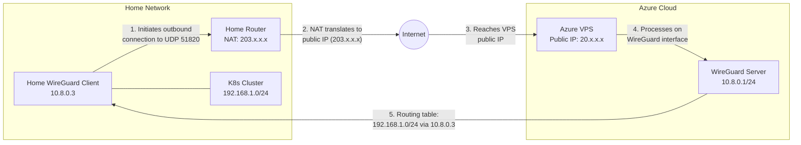
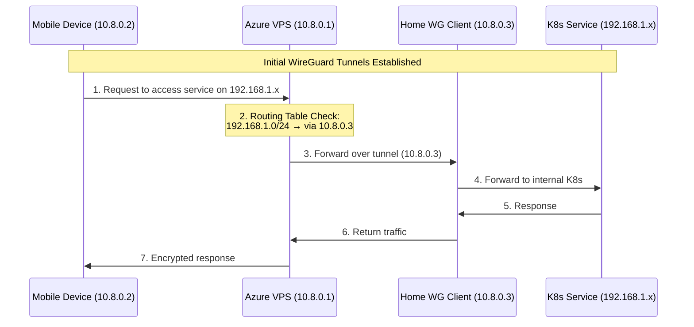
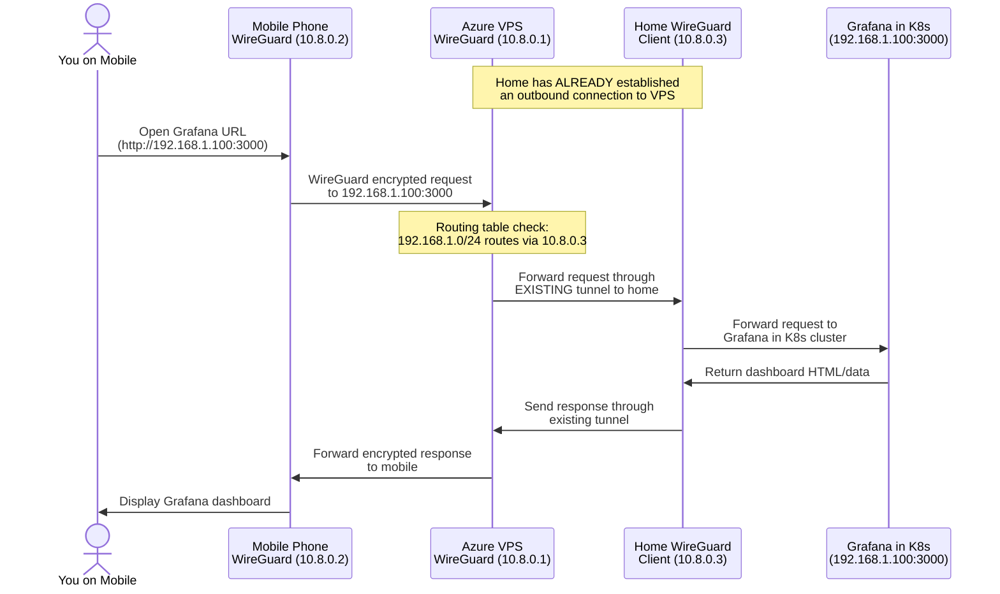

# ./plan.md

---

This file explains a direct, verifiable plan for connecting a mobile device to a home Kubernetes cluster without modifying home router ports, by using an Azure VPS as an intermediary with WireGuard in a hub-and-spoke model
---

## 1) Overview

- **Azure VPS**: Create an Ubuntu/Debian VM in Azure to act as a WireGuard "hub."
- **Home Cluster Outbound Tunnel**: One Kubernetes node on your 3-node mini-PC setup will run WireGuard, establishing an outbound connection to the VPS. This single node will route traffic for the entire 192.168.1.0/24 network.
- **Mobile Device Tunnel**: A WireGuard client on your phone connects to the VPS (public IP) so that all requests for 192.168.1.x addresses are routed through the VPS to your home cluster.
- **No Home Router Modification**: Because the cluster initiates the connection outbound, no ports are opened on the home router.

## 2) Stage 1: Phone → VPS WireGuard Setup

### 2.1 Install & Enable WireGuard on the Azure VPS

1. Provision VPS
   - Create an Ubuntu or Debian VM in Azure
   - Verify it has an external (public) IP address

2. SSH into the VM:

   ```bash
   ssh <azure_username>@<public_ip_of_azure_vm>
   ```

3. Install WireGuard and qrencode:

   ```bash
   sudo apt-get update
   sudo apt-get install -y wireguard qrencode
   ```

4. Enable IP forwarding:

   ```bash
   sudo sed -i 's/#net.ipv4.ip_forward=1/net.ipv4.ip_forward=1/' /etc/sysctl.conf
   sudo sysctl -p
   ```

### 2.2 Configure WireGuard on VPS for Mobile Clients

1. Generate VPS server keys:

   ```bash
   cd /etc/wireguard
   sudo umask 077
   sudo wg genkey | tee server_private.key | wg pubkey > server_public.key
   ```

2. Create `/etc/wireguard/wg0.conf`:

   ```bash
   cat <<EOF | sudo tee /etc/wireguard/wg0.conf
   [Interface]
   Address = 10.8.0.1/24
   ListenPort = 51820
   PrivateKey = $(cat server_private.key)
   PostUp   = iptables -t nat -A POSTROUTING -o eth0 -j MASQUERADE
   PostDown = iptables -t nat -D POSTROUTING -o eth0 -j MASQUERADE
   EOF
   ```

3. Enable and start WireGuard:

   ```bash
   sudo systemctl enable wg-quick@wg0
   sudo systemctl start wg-quick@wg0
   sudo wg show
   ```

### 2.3 Create Mobile Client Config

1. Generate mobile client keys (on the VPS for convenience):

   ```bash
   cd ~
   umask 077
   wg genkey | tee client.key | wg pubkey > client.pub
   ```

2. Create mobile config file (`~/client.conf`):

   ```bash
   cat <<EOF > ~/client.conf
   [Interface]
   Address = 10.8.0.2/24
   PrivateKey = $(cat client.key)
   DNS = 1.1.1.1

   [Peer]
   PublicKey = $(cat /etc/wireguard/server_public.key)
   Endpoint = $(curl -s ifconfig.me):51820
   AllowedIPs = 0.0.0.0/0
   PersistentKeepalive = 25
   EOF
   ```

3. Add mobile client as peer in VPS config:

   ```bash
   sudo bash -c "cat >> /etc/wireguard/wg0.conf" <<PEER

   # Mobile client
   [Peer]
   PublicKey = $(cat client.pub)
   AllowedIPs = 10.8.0.2/32
   PEER
   ```

4. Restart WireGuard:

   ```bash
   sudo systemctl restart wg-quick@wg0
   ```

5. Generate QR code for mobile import:

   ```bash
   qrencode -t ansiutf8 < ~/client.conf
   ```

6. Scan with the WireGuard app on your phone, save, then enable the tunnel.

## 3) Stage 2: Home Cluster → VPS WireGuard Setup

Your home cluster is a 3-node Kubernetes setup on mini-PCs. Choose one node (call it "Node-A") to serve as the WireGuard client/gateway.

### 3.1 Install & Enable WireGuard on Node-A

1. SSH into Node-A (which must have outbound internet access)

2. Install WireGuard:

   ```bash
   sudo apt-get update
   sudo apt-get install -y wireguard
   sudo sed -i 's/#net.ipv4.ip_forward=1/net.ipv4.ip_forward=1/' /etc/sysctl.conf
   sudo sysctl -p
   ```

3. Generate keys:

   ```bash
   cd /etc/wireguard
   sudo umask 077
   sudo wg genkey | tee home_private.key | wg pubkey > home_public.key
   ```

### 3.2 Configure Node-A WireGuard

1. Create `wg0-home.conf`:

   ```bash
   cat <<EOF | sudo tee /etc/wireguard/wg0-home.conf
   [Interface]
   Address = 10.8.0.3/24
   PrivateKey = $(cat /etc/wireguard/home_private.key)
   
   [Peer]
   PublicKey = <SERVER_PUBLIC_KEY_FROM_AZURE_VPS>
   Endpoint = <PUBLIC_IP_OF_AZURE_VPS>:51820
   AllowedIPs = 10.8.0.0/24
   PersistentKeepalive = 25
   EOF
   ```

2. Enable and start the tunnel:

   ```bash
   sudo systemctl enable wg-quick@wg0-home
   sudo systemctl start wg-quick@wg0-home
   ```

### 3.3 Add Home Peer to VPS

1. On the VPS: Append Node-A's public key and subnets to `/etc/wireguard/wg0.conf`:

   ```bash
   # SSH into the Azure VPS and run:
   sudo bash -c "cat >> /etc/wireguard/wg0.conf" <<PEER
   
   # Home Cluster (Node-A)
   [Peer]
   PublicKey = <HOME_PUBLIC_KEY>
   AllowedIPs = 10.8.0.3/32, 192.168.1.0/24
   PEER
   ```

2. Restart WireGuard on VPS:

   ```bash
   sudo systemctl restart wg-quick@wg0
   ```

### 3.4 Routing for Entire K8s Cluster

- Node-A must forward traffic for 192.168.1.0/24 across the tunnel. Since Node-A is physically on your LAN with IP 192.168.1.x, it can reach all K8s nodes.
- Verify that each K8s node (192.168.1.x) is reachable from Node-A so that it can forward packets.
- The Azure VPS is told: "All traffic to 192.168.1.0/24 goes through 10.8.0.3 (Node-A)."

Result: Any request that arrives on the Azure VPS for 192.168.1.x is sent to Node-A's WireGuard IP (10.8.0.3). Node-A then routes it internally to the appropriate K8s node/service.

## 4) Verification

1. Check tunnels:

   ```bash
   # On Node-A:
   sudo wg show
   
   # On Azure VPS:
   sudo wg show
   ```

   Confirm handshakes for Node-A (10.8.0.3) and mobile device (10.8.0.2).

2. Ping tests:
   - From Node-A: `ping 10.8.0.1` (VPS)
   - From VPS: `ping 10.8.0.3` (Node-A) or `ping 192.168.1.<some_node>`
   - From Mobile: Connect WireGuard, then ping 10.8.0.1 and any 192.168.1.x IP in the cluster

3. Access K8s service:
   - On your phone, enable WireGuard
   - Access <http://192.168.1.100:3000> (Grafana example) or any other nodeport/cluster IP

## 5) Detailed Explanation with Diagrams

You have two tunnels:

- Phone → VPS (10.8.0.2 ↔ 10.8.0.1)
- Home Node-A → VPS (10.8.0.3 ↔ 10.8.0.1)

Node-A acts as the gateway for the entire 192.168.1.0/24 K8s cluster.

### Home-to-VPS Connection Mechanism



### How Traffic Flows



### Practical Example: Accessing Grafana Dashboard from Mobile



### Network Address Translation (NAT) in Detail

```
┌───────────────┐          ┌──────────────┐          ┌──────────────┐
│ Mobile Device │          │  Azure VPS   │          │ Home Network │
│  10.8.0.2     │          │  Public IP:  │          │ Public IP:   │
│               │          │  20.x.x.x    │          │ 203.x.x.x    │
└───────┬───────┘          └──────┬───────┘          └──────┬───────┘
        │                         │                         │
        │ WireGuard               │                         │
        │ Tunnel                  │                         │
        ▼                         ▼                         │
┌───────────────┐          ┌──────────────┐                 │
│   WG Virtual  │          │  WG Virtual  │                 │
│   Interface   │◄────────►│  Interface   │                 │
│   10.8.0.2    │          │  10.8.0.1    │                 │
└───────────────┘          └──────┬───────┘                 │
                                  │                         │
                                  │                         │
                                  │         WireGuard       │
                                  │         Tunnel          │
                                  ▼                         ▼
                           ┌──────────────┐          ┌──────────────┐
                           │  Routing:    │          │   NAT Table  │
                           │192.168.1.0/24│          │ Maps between │
                           │  via 10.8.0.3│          │ public/private│
                           └──────┬───────┘          └──────┬───────┘
                                  │                         │
                                  │                         │
                                  │                         ▼
                                  │                  ┌──────────────┐
                                  │                  │  WG Virtual  │
                                  └─────────────────►│  Interface   │
                                                     │  10.8.0.3    │
                                                     └──────┬───────┘
                                                            │
                                                            ▼
                                                     ┌──────────────┐
                                                     │ K8s Cluster  │
                                                     │192.168.1.0/24│
                                                     └──────────────┘
```

## 6) Common Pitfalls and Troubleshooting

1. **Azure NSG**:
   - Confirm UDP/51820 inbound is allowed

2. **IP Forwarding**:
   - `sysctl net.ipv4.ip_forward` must be 1 on both VPS and Node-A
   - Check with: `sysctl net.ipv4.ip_forward`

3. **Iptables Masquerade**:
   - VPS PostUp and PostDown rules ensure NAT is working on the Azure side
   - Verify with: `sudo iptables -t nat -L POSTROUTING`

4. **Routing**:
   - Ensure AllowedIPs includes both 10.8.0.0/24 and 192.168.1.0/24 in the right places
   - On the VPS, check routes with: `ip route show`

5. **MTU Considerations**:
   - If you see fragmentation, reduce MTU to ~1420 in the [Interface] section

6. **PersistentKeepalive**:
   - Must be set to keep the NAT session alive (25 seconds is recommended)

7. **One Node as Gateway**:
   - Confirm Node-A can see all other K8s nodes on 192.168.1.x

## Final Notes

- **No Router Ports**: Node-A's outbound tunnel to Azure means no inbound port changes on the home router
- **Full K8s Access**: Since Node-A routes to 192.168.1.0/24, the entire cluster is reachable from your phone via the VPS
- **Security**: Traffic is encrypted at all times using WireGuard
- **Easy Phone Setup**: Just scan the QR code or manually import the .conf file
