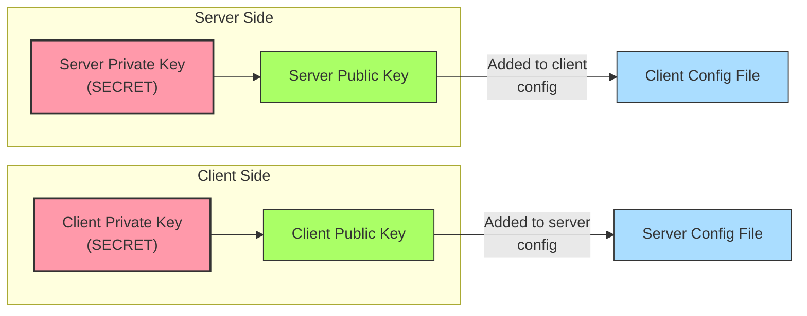
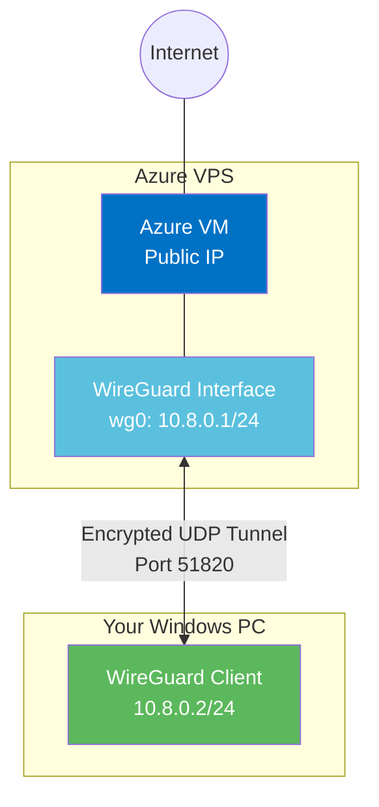
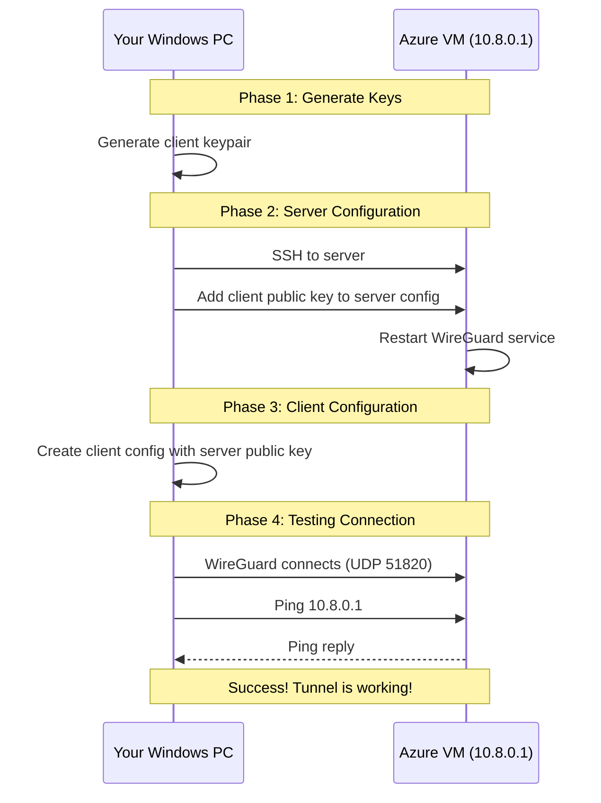
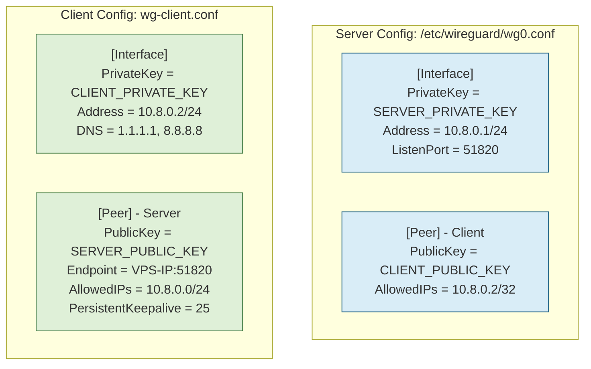

# Verification Plan: WireGuard Basic Client Access Test

## Task Description

This document outlines the steps to create and verify a minimal WireGuard client configuration to test connectivity to our VPN server. This basic verification ensures the WireGuard server is properly set up before implementing more complex peer configurations.

## Visual Overview

### WireGuard Key Relationship



### Network Topology



### Connection Flow



## Implementation Overview

1. Generate a test client key pair
2. Add a client peer configuration to the WireGuard server
3. Create a local client configuration file
4. Test basic connectivity through the VPN

## Step-by-Step Process

### PHASE 1: CLIENT KEY GENERATION (Run on your HOME PC)

1. Generate a test client key pair:

   ```bash
   # On HOME PC
   # Generate client private key
   wg genkey > wireguard_client_private.key
   
   # Generate client public key from private key
   wg pubkey < wireguard_client_private.key > wireguard_client_public.key
   
   # View keys (for configuration purposes)
   echo "Client private key: $(cat wireguard_client_private.key)"
   echo "Client public key: $(cat wireguard_client_public.key)"
   ```

### PHASE 2: SERVER PEER CONFIGURATION (Run on your VPS)

1. SSH into the VPS:

   ```bash
   ssh azureuser@<vps-ip-address>
   ```

2. Add client as a peer to the WireGuard server configuration:

   ```bash
   # On VPS
   # Backup the current config
   sudo cp /etc/wireguard/wg0.conf /etc/wireguard/wg0.conf.backup
   
   # Add the client peer to the configuration
   sudo tee -a /etc/wireguard/wg0.conf << EOF
   
   # Test Client
   [Peer]
   PublicKey = $(cat wireguard_client_public.key)  # Replace with your client public key
   AllowedIPs = 10.8.0.2/32
   EOF
   
   # Restart the WireGuard interface to apply changes
   sudo systemctl restart wg-quick@wg0
   
   # Verify the peer was added
   sudo wg show
   ```

### PHASE 3: CLIENT CONFIGURATION (Run on your HOME PC)

1. Make sure you're using the correct server public key from your environment:

   ```bash
   # On HOME PC
   # First, ensure your environment variables are loaded
   source .env
   
   # Verify you can see the server public key
   echo $TF_VAR_wg_server_public_key
   
   # This should match the public key on the server
   # You can verify with:
   ssh azureuser@<vps-ip-address> "cat /etc/wireguard/server_public.key"
   ```

2. Create a client configuration file with the exact keys:

   ```bash
   # On HOME PC
   # Create a basic client configuration
   cat > wg-client.conf << EOF
   [Interface]
   PrivateKey = $(cat wireguard_client_private.key)
   Address = 10.8.0.2/24
   DNS = 1.1.1.1, 8.8.8.8
   
   [Peer]
   PublicKey = $TF_VAR_wg_server_public_key
   Endpoint = <vps-ip-address>:51820
   AllowedIPs = 10.8.0.0/24
   PersistentKeepalive = 25
   EOF
   
   # Verify the configuration has the correct keys
   cat wg-client.conf
   ```

3. Securely clean up the key files (optional if kept for testing):

   ```bash
   # On HOME PC - Only do this after saving the client config
   shred -u wireguard_client_private.key
   shred -u wireguard_client_public.key
   ```

### PHASE 4: CONNECTIVITY TESTING USING WINDOWS CLIENT

1. Install the WireGuard client for Windows:
   - Download the installer from [https://www.wireguard.com/install/](https://www.wireguard.com/install/)
   - Run the installer and follow the prompts

2. Import the configuration:
   - Open the WireGuard client application
   - Click the "Import tunnel(s) from file" button
   - Select your `wg-client.conf` file
   - Alternatively, you can drag and drop the file into the WireGuard window

3. Connect and verify:
   - Click the "Activate" button to connect to the VPN
   - The status should change to "Active" with a green background
   - Open a command prompt and test connectivity:

     ```cmd
     ping 10.8.0.1
     ```

   - You should see successful ping responses from the server

4. Check the connection details:
   - Click the "Edit" button to view the connection details
   - Verify the configuration matches what you expect
   - The log tab may provide useful information for troubleshooting

5. Disconnect when done testing:
   - Click the "Deactivate" button to disconnect from the VPN

### Configuration File Overview



## Success Criteria

The task is considered successful when:

1. Client key pair is successfully generated
2. Server configuration correctly includes the client peer
3. Client configuration properly references the server public key from your environment variables
4. WireGuard Windows client successfully connects to the server
5. Ping works from the client to the server (10.8.0.1)
6. The WireGuard interface (10.8.0.2) is properly configured on the client

## Notes

- This is a minimal configuration for testing purposes only
- The WireGuard Windows client installation is required
- The client has only a single IP (10.8.0.2/32) without additional access
- For a production scenario, consider configuring proper routing rules
- Client configuration should be stored securely as it contains the private key
- We're using the exact same server public key that's already deployed to the VPS via Terraform
