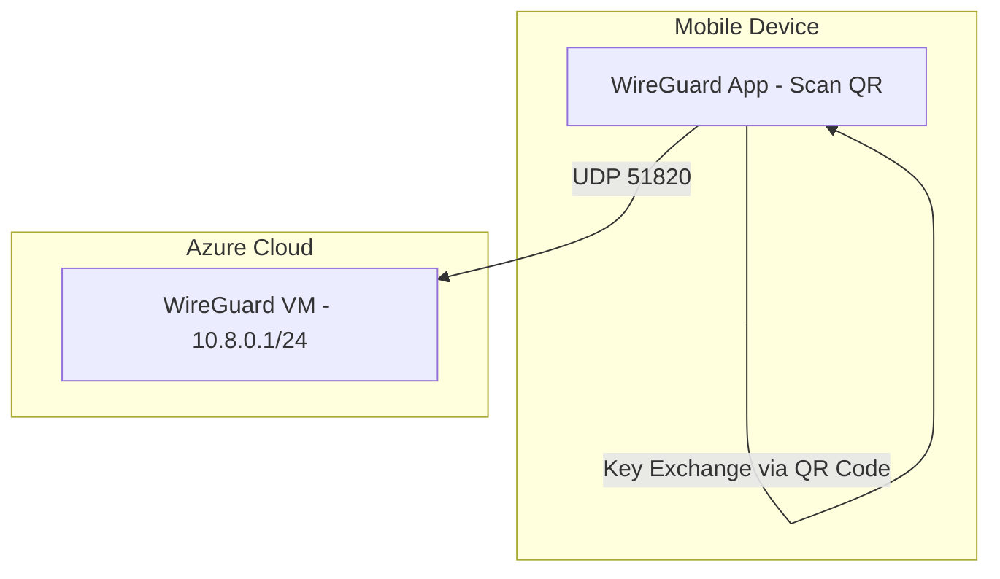

# Minimal WireGuard Setup with QR Code on Azure VM

Follow these steps exactly to create a simple WireGuard client configuration on your Azure VM, generate a QR code, then scan it with the official WireGuard mobile app.

---

## 1) Connect to Your Azure VM via SSH

Log into your Azure VM:

```bash
ssh azureuser@<YOUR_VM_PUBLIC_IP>
```

---

## 2) Install Packages on the VM

Update apt and install `qrencode` (for generating the QR code). WireGuard is already installed if you used the Terraform config, but let's ensure everything is present:

```bash
sudo apt-get update
sudo apt-get install -y qrencode wireguard
```

---

## 3) Run the Script to Set Up a Test Client

Copy and paste the following script as-is. It will:

1. Generate a new client keypair in `~/client.key` and `~/client.pub`.
2. Create a minimal client config at `~/client.conf`.
3. Append the client's public key to your server config in `/etc/wireguard/wg0.conf`.
4. Restart WireGuard.
5. Print a QR code you can scan from the mobile app.

```bash
# ===========================================
# WIREGUARD SIMPLE CLIENT SETUP SCRIPT
# ===========================================

# 1) Generate a fresh client keypair in your home directory
cd ~
umask 077
wg genkey | tee client.key | wg pubkey > client.pub

# 2) Create a minimal client config file
# We'll use 10.8.0.2/24 as the client's VPN IP address
# assuming your server is 10.8.0.1/24 in wg0.conf
# We'll dynamically grab your server's external IP with curl
cat <<EOF > client.conf
[Interface]
Address = 10.8.0.2/24
PrivateKey = $(cat client.key)
DNS = 1.1.1.1

[Peer]
PublicKey = $(cat /etc/wireguard/server_public.key)
Endpoint = \$(curl -s ifconfig.me):51820
AllowedIPs = 0.0.0.0/0
PersistentKeepalive = 25
EOF

# 3) Append this client as a peer on your server's wg0.conf
# so the server knows about the new client
sudo cp /etc/wireguard/wg0.conf /etc/wireguard/wg0.conf.bak
sudo bash -c "cat >> /etc/wireguard/wg0.conf" <<PEER

# Simple test client
[Peer]
PublicKey = $(cat client.pub)
AllowedIPs = 10.8.0.2/32
PEER

# 4) Restart WireGuard to load the new peer config
sudo systemctl restart wg-quick@wg0

# 5) Display a QR code for quick import on mobile devices
echo
echo "===================== QR CODE ======================"
qrencode -t ansiutf8 < client.conf
echo "===================================================="
echo
echo "Done! Your new client config is at ~/client.conf"
echo "Use the QR code above or the config file for WireGuard mobile app."
```

---

## 4) Scan the QR Code from Your WireGuard Mobile App

1. Open the WireGuard app on your phone.
2. Tap the **+** (Add Tunnel) button.
3. Choose **Scan from QR code**.
4. Point your camera at the QR code displayed in your SSH session.
5. Name the tunnel (e.g., `WG-Test`), then save.
6. Toggle **ON** to connect.

---

## 5) Test Connectivity

Once the mobile app is connected:

- Confirm the status in the WireGuard app is **Connected**.
- Open a terminal app on your mobile (Termux, for example), or use another device on the same network.
- Ping the server's VPN interface:

```bash
ping 10.8.0.1
```

- If you see successful replies, your WireGuard tunnel is working.

---

## 6) Summary

You have successfully generated a test client config, added it to the server, and connected via QR code on your mobile device. You can reuse or discard these keys as needed.

That's it — you now have a minimal, working WireGuard setup with a quick QR-based mobile config.
