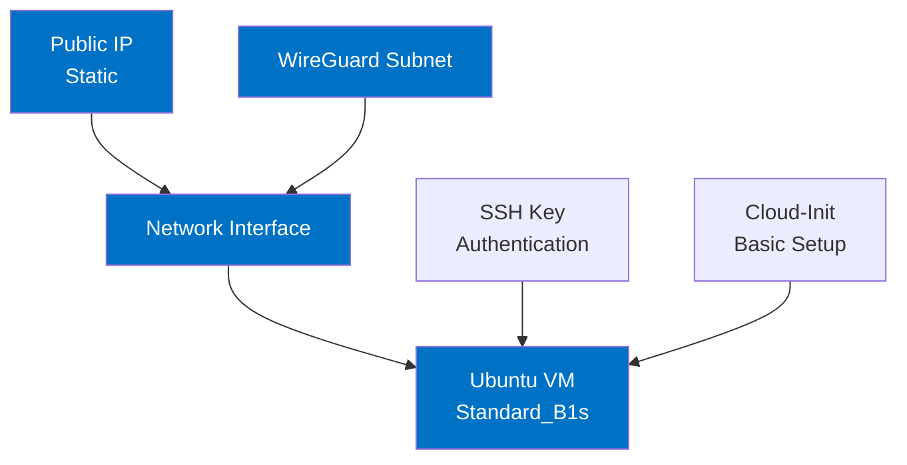

# VM Module for WireGuard Server

This module provisions an Azure VM configured for WireGuard VPN server.

## WireGuard Keys Management

WireGuard keys are generated locally and passed to Terraform through environment variables for security. This approach:

1. Keeps keys out of version control
2. Maintains consistent server identity across rebuilds
3. Secures sensitive cryptographic material

### Setup Instructions

1. Generate WireGuard keys locally:

```bash
# Install WireGuard tools if needed
sudo apt-get update
sudo apt-get install wireguard-tools

# Generate private key
wg genkey > wireguard_server_private.key

# Generate public key from private key
wg pubkey < wireguard_server_private.key > wireguard_server_public.key
```

2. Store keys in a local `.env` file at the repository root:

```bash
# Create or overwrite .env file with the correct TF_VAR_ prefix
echo "TF_VAR_wg_server_private_key=$(cat wireguard_server_private.key)" > .env
echo "TF_VAR_wg_server_public_key=$(cat wireguard_server_public.key)" >> .env
```

3. Secure the original key files:

```bash
shred -u wireguard_server_private.key
shred -u wireguard_server_public.key
```

4. Add `.env` to `.gitignore`:

```bash
echo ".env" >> .gitignore
```

5. Before running Terraform, load the environment variables:

```bash
# Load environment variables into current shell session
source .env

# Verify variables are loaded correctly
env | grep TF_VAR_wg

# Now run Terraform commands
terraform plan
terraform apply
```

> **Important Note**: Terraform automatically maps environment variables with the `TF_VAR_` prefix to 
> corresponding variables in your Terraform configuration. For example, `TF_VAR_wg_server_private_key` 
> will be used for the Terraform variable `wg_server_private_key`.

### Key Verification

After deployment, verify keys were correctly deployed:

```bash
# SSH to the VPS
ssh azureuser@<vps-ip-address>

# Verify the azureuser is in the wireguard group
groups

# Verify key files exist with correct permissions
ls -la /etc/wireguard/

# Expected permissions:
# drwxr-x--- for /etc/wireguard/ directory (750)
# -rw------- for server_private.key (600)
# -rw-r--r-- for server_public.key (644)
# Directory and public key should be owned by group 'wireguard'

# Verify public key is readable without sudo
cat /etc/wireguard/server_public.key

# Private key should still require sudo
sudo cat /etc/wireguard/server_private.key

# Verify key validity
sudo wg pubkey < /etc/wireguard/server_private.key | diff - /etc/wireguard/server_public.key
```

## Usage in Terraform Root Module

```terraform
module "wireguard_vm" {
  source = "./vm"
  
  # ... other variables ...
  
  # WireGuard keys from environment variables
  wg_server_private_key = var.wg_server_private_key
  wg_server_public_key  = var.wg_server_public_key
}
```

Add these variables to your root `variables.tf`:

```terraform
variable "wg_server_private_key" {
  description = "WireGuard server private key"
  type        = string
  sensitive   = true
}

variable "wg_server_public_key" {
  description = "WireGuard server public key"
  type        = string
}
```

## Architecture



## Components

- **Public IP Address**: Static IP for consistent external access
- **Network Interface**: Connected to the specified subnet
- **Ubuntu VM**:
  - Size: Standard_B1s (1 vCPU, 1 GB memory)
  - OS: Ubuntu 22.04 LTS
  - Authentication: SSH key-based only
  - Identity: System-assigned managed identity

## Design Considerations

- **VM Size**: Standard_B1s balances cost and performance for WireGuard
  workloads
- **OS**: Ubuntu 22.04 LTS provides kernel-level WireGuard support
- **Security**:
  - SSH key authentication with no password access
  - System hardened via cloud-init script
  - Static IP for consistent firewall rules
- **Identity**: Managed identity enables secure Azure resource access

## Configuration

### Required Variables

- `subnet_id`: ID of the subnet where the VM will be deployed
- `ssh_public_key`: SSH public key for VM access authentication

### Usage Example

```hcl
module "vm" {
  source = "./vm"
  
  subnet_id = module.network.wireguard_subnet_id
  ssh_public_key = "ssh-rsa AAAA...your-key...example"
  
  # Optional parameters
  # resource_group_name = "custom-rg"
  # location = "australiaeast"
  # vm_size = "Standard_B2s"
}
```

### Environment Variable

SSH public key can be provided via environment variable:

```bash
export TF_VAR_ssh_public_key="ssh-rsa AAAA...your-key...example"
```

## Initial Configuration

The VM is provisioned with cloud-init that performs:

- System updates and utility installation
- Hostname configuration
- SSH hardening:
  - Root login disabled
  - Password authentication disabled

## Verification

The VM deployment can be verified by SSHing into the created server:

```bash
# Get the public IP address
PUBLIC_IP=$(terraform output -raw vm_public_ip)

# SSH into the VM using the azureuser and your private key
ssh azureuser@$PUBLIC_IP

# Expected output: Successful login to Ubuntu server
# Welcome to Ubuntu 22.04.5 LTS (GNU/Linux 6.8.0-1021-azure x86_64)
```

Alternatively, use the pre-formatted SSH command from the outputs:

```bash
# Get the SSH command with the correct username and IP
$(terraform output -raw ssh_command)
```

## VM Recreation and SSH Host Keys

When the VM is recreated through Terraform (due to config changes or manual
destroy/apply), the SSH host keys will be regenerated. This causes SSH client
verification failures with messages like:

```
@@@@@@@@@@@@@@@@@@@@@@@@@@@@@@@@@@@@@@@@@@@@@@@@@@@@@@@@@@@
@    WARNING: REMOTE HOST IDENTIFICATION HAS CHANGED!     @
@@@@@@@@@@@@@@@@@@@@@@@@@@@@@@@@@@@@@@@@@@@@@@@@@@@@@@@@@@@
```

### Handling Host Key Changes

To fix this SSH host key verification error:

1. Remove the old host key for the IP address:

   ```bash
   # Get the VM's IP address and remove it from known_hosts
   ssh-keygen -f ~/.ssh/known_hosts -R $(terraform output -raw vm_public_ip)
   ```

2. After removing the old key, SSH will prompt to accept the new host key on the
   next connection attempt.

This is expected behavior for ephemeral infrastructure and not a security issue
when the VM is intentionally recreated as part of infrastructure management.
