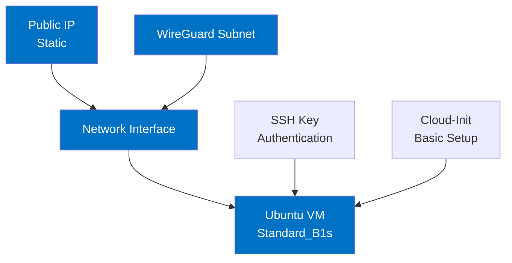

# Virtual Machine Infrastructure

This directory contains Terraform configuration for the Ubuntu VM that will host the WireGuard VPN server.

## Architecture Overview



## Infrastructure Components

- **Public IP Address**: Static IP to ensure it doesn't change on VM restart
- **Network Interface**: Connected to the WireGuard subnet
- **Ubuntu VM**: 
  - Size: Standard_B1s (1 vCPU, 1 GB memory)
  - OS: Ubuntu 22.04 LTS (Jammy Jellyfish)
  - Authentication: SSH key-based (no password)
  - Managed Identity: System-assigned for Azure resource access

## Design Decisions

1. **VM Size Selection**: Standard_B1s is cost-effective yet sufficient for WireGuard which has minimal resource requirements.

2. **OS Choice**: Ubuntu 22.04 LTS provides long-term support and stability with modern kernel features required for WireGuard.

3. **Security Considerations**:
   - SSH key authentication only (no password)
   - System hardening via cloud-init
   - Static public IP for consistent firewall rules

4. **Managed Identity**: The VM has a system-assigned managed identity to facilitate secure access to other Azure resources without storing credentials.

## SSH Key Configuration

The VM module requires an SSH public key for secure authentication. You must provide the key content directly through the `ssh_public_key` variable.

Example usage in main.tf:
```hcl
module "vm" {
  source = "./vm"
  
  subnet_id = module.network.wireguard_subnet_id
  ssh_public_key = "ssh-rsa AAAA...your-key...example"
  
  # Other optional parameters
  # resource_group_name = "custom-rg"
  # location = "eastus"
  # vm_size = "Standard_B2s"
}
```

You can also use an environment variable:
```bash
export TF_VAR_ssh_public_key="ssh-rsa AAAA...your-key...example"
terraform apply
```

A template file `.env.ssh.sample` is provided at the root of the repository to help with this configuration.

## Initial VM Setup

The VM is provisioned with a cloud-init script that:
- Updates the system and installs basic utilities
- Sets the proper hostname
- Disables root login via SSH
- Disables password authentication

## Next Steps

Once the VM is created, the next step is to install and configure WireGuard. 