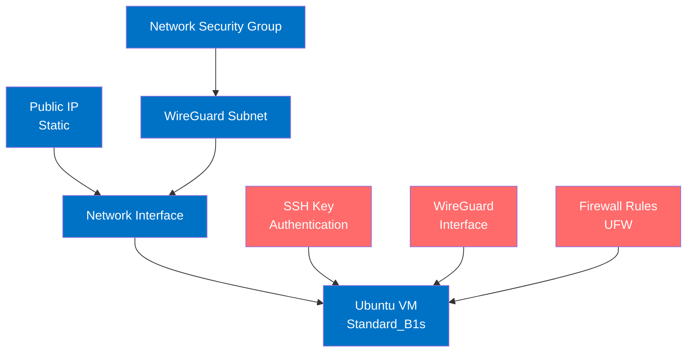
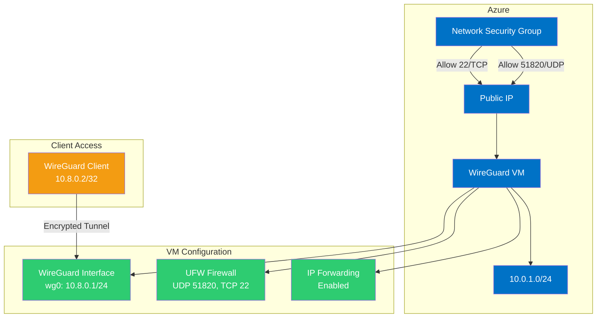

# VM Module for WireGuard VPN Server

This module provisions an Azure VM configured for WireGuard VPN server with secure networking configuration.

## Architecture

## Network Architecture

## Components

- **Public IP Address**: Static IP for consistent external access
- **Network Interface**: Connected to the specified subnet
- **Network Security Group**: Allows traffic on ports 51820/UDP (WireGuard) and 22/TCP (SSH)
- **Ubuntu VM**:
  - Size: Standard_B1s (1 vCPU, 1 GB memory)
  - OS: Ubuntu 22.04 LTS
  - Authentication: SSH key-based only
  - Identity: System-assigned managed identity

## WireGuard Configuration

- **Interface**: wg0 configured with IP address 10.8.0.1/24
- **Port**: Listening on standard WireGuard port 51820/UDP
- **Key Management**: Secure cryptographic keys with proper permissions
- **IP Forwarding**: Enabled for VPN traffic routing
- **Firewall**: Configured with UFW to allow WireGuard and SSH traffic
- **Routing**: PostUp/PostDown rules for proper traffic routing

## WireGuard Key Relationship

WireGuard uses public-key cryptography where:

- Server and client keys are NOT derived from each other - each generates their own independent key pair
- Authentication happens by exchanging public keys (server knows client's public key, client knows server's public key)
- Each side uses their private key + the other's public key to create an encrypted tunnel
- No password exchange occurs - the mathematical relationship between public-private keys enables secure communication

## Design Considerations

- **VM Size**: Standard_B1s balances cost and performance for WireGuard workloads
- **OS**: Ubuntu 22.04 LTS provides kernel-level WireGuard support
- **Security**:
  - SSH key authentication with no password access
  - System hardened via cloud-init script
  - Static IP for consistent firewall rules
  - Restricted WireGuard key permissions
  - Dedicated wireguard system group for key access
- **Network Isolation**:
  - VPN traffic separated on dedicated subnet (10.8.0.0/24)
  - Azure NSG and VM-level firewall for defense in depth
- **Identity**: Managed identity enables secure Azure resource access
- **Persistence**:
  - WireGuard service configured to start on boot
  - IP forwarding configured to persist after reboots
