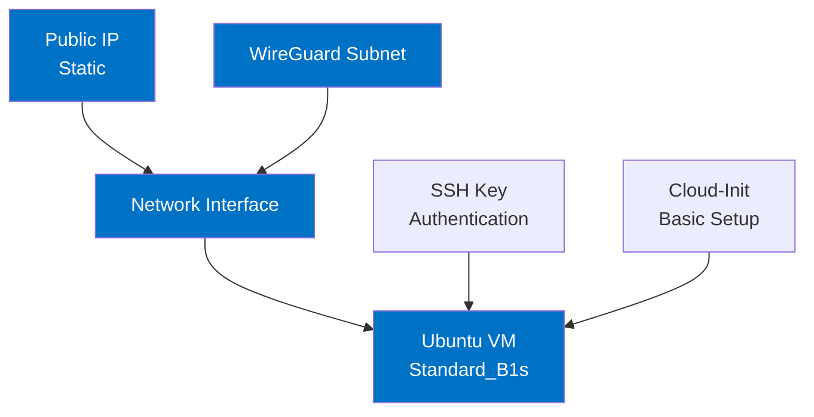

# VM Module

Ubuntu virtual machine for hosting WireGuard VPN server in Azure.

## Architecture



## Components

- **Public IP Address**: Static IP for consistent external access
- **Network Interface**: Connected to the specified subnet
- **Ubuntu VM**:
  - Size: Standard_B1s (1 vCPU, 1 GB memory)
  - OS: Ubuntu 22.04 LTS
  - Authentication: SSH key-based only
  - Identity: System-assigned managed identity

## Design Considerations

- **VM Size**: Standard_B1s balances cost and performance for WireGuard workloads
- **OS**: Ubuntu 22.04 LTS provides kernel-level WireGuard support
- **Security**:
  - SSH key authentication with no password access
  - System hardened via cloud-init script
  - Static IP for consistent firewall rules
- **Identity**: Managed identity enables secure Azure resource access

## Configuration

### Required Variables

- `subnet_id`: ID of the subnet where the VM will be deployed
- `ssh_public_key`: SSH public key for VM access authentication

### Usage Example

```hcl
module "vm" {
  source = "./vm"
  
  subnet_id = module.network.wireguard_subnet_id
  ssh_public_key = "ssh-rsa AAAA...your-key...example"
  
  # Optional parameters
  # resource_group_name = "custom-rg"
  # location = "australiaeast"
  # vm_size = "Standard_B2s"
}
```

### Environment Variable

SSH public key can be provided via environment variable:

```bash
export TF_VAR_ssh_public_key="ssh-rsa AAAA...your-key...example"
```

## Initial Configuration

The VM is provisioned with cloud-init that performs:

- System updates and utility installation
- Hostname configuration
- SSH hardening:
  - Root login disabled
  - Password authentication disabled

## Verification

The VM deployment can be verified by SSHing into the created server:

```bash
# Get the public IP address
PUBLIC_IP=$(terraform output -raw vm_public_ip)

# SSH into the VM using the azureuser and your private key
ssh azureuser@$PUBLIC_IP

# Expected output: Successful login to Ubuntu server
# Welcome to Ubuntu 22.04.5 LTS (GNU/Linux 6.8.0-1021-azure x86_64)
```

Alternatively, use the pre-formatted SSH command from the outputs:

```bash
# Get the SSH command with the correct username and IP
$(terraform output -raw ssh_command)
```
